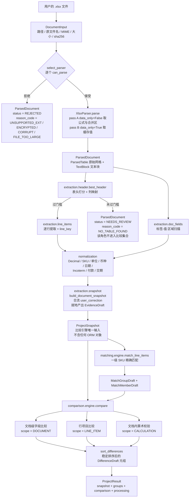
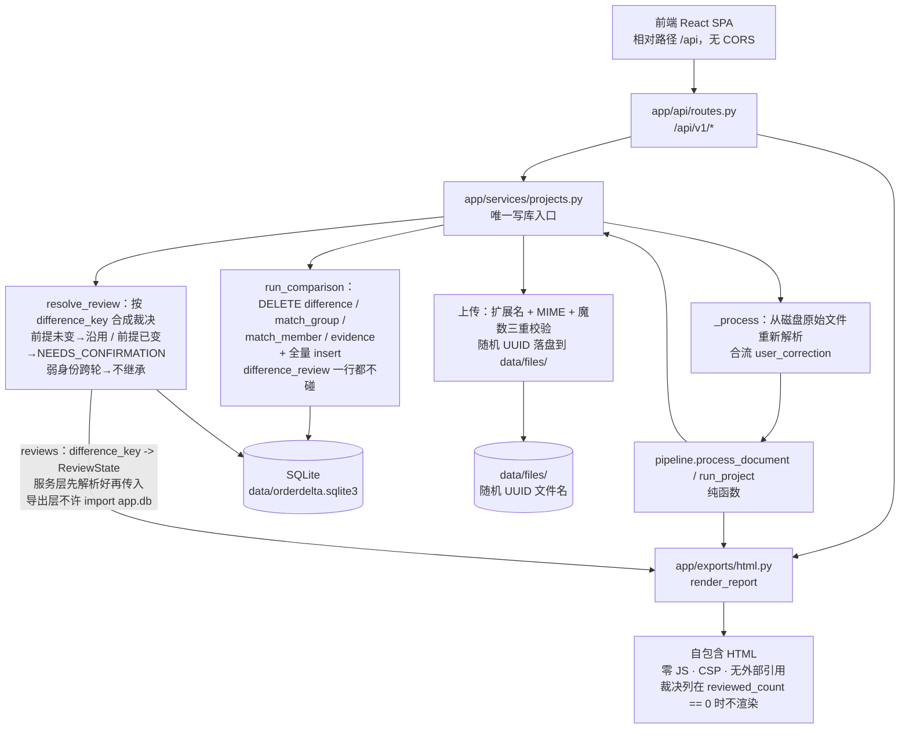
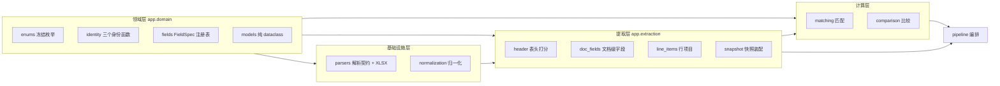
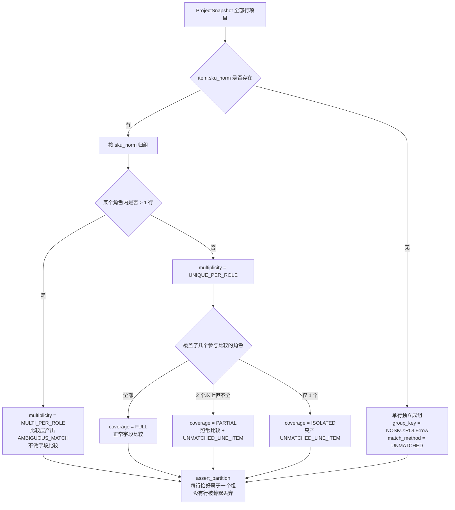
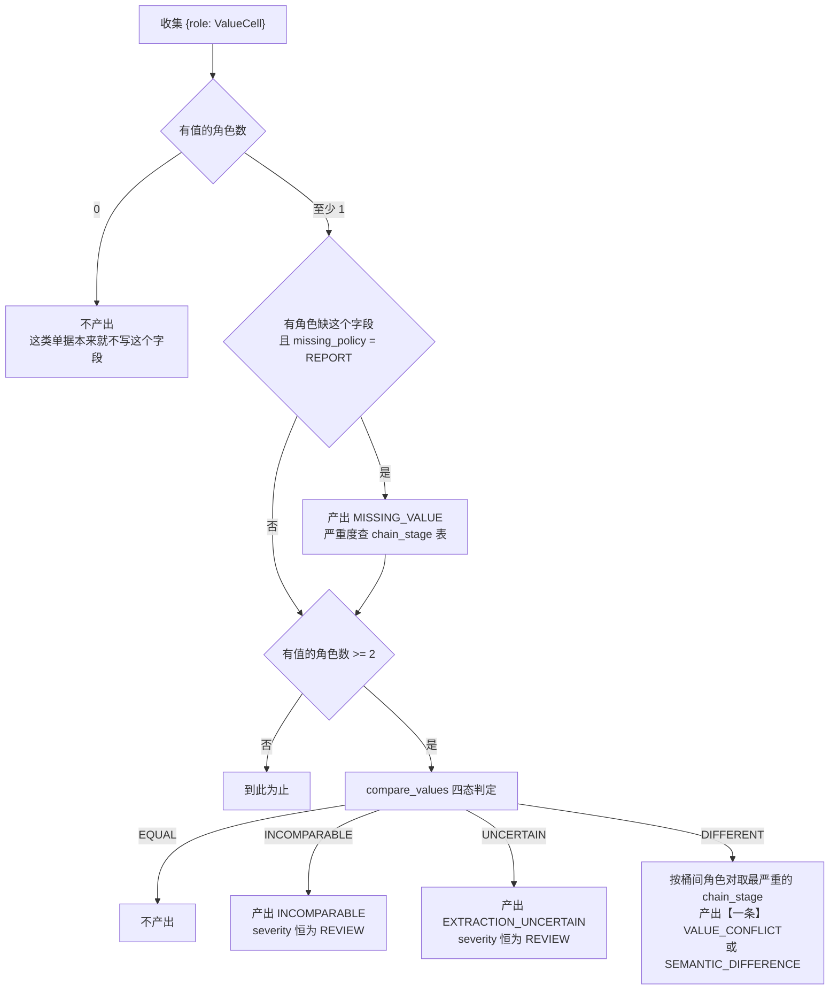

# 架构说明

> 权威规格是 [`SPEC.md`](SPEC.md)。本文描述**当前代码的实际形态**，读代码得来，不是设计愿景。
> 凡本文与代码冲突，以代码为准，并请修正本文。

---

## 0. 当前实现状态

MVP-0 的**全链路已经贯通**：上传 → 解析 → 提取 → 标准化 → 快照 → 匹配 → 比较 →
差异 + 证据 → SQLite 持久化 → 人工审核 → 自包含 HTML 报告 → 删除项目。

| 目录 | 状态 | 说明 |
|---|---|---|
| `app/domain/` | ✅ 已实现 | 枚举全集、身份函数、FieldSpec 注册表、纯领域模型 |
| `app/parsers/` | ✅ 已实现 | 解析契约 + XLSX 解析器 |
| `app/normalization/` | ✅ 已实现 | 9 个归一化模块 |
| `app/extraction/` | ✅ 已实现 | 表头定位、文档级字段、行项目、快照装配 |
| `app/matching/` | ✅ 已实现 | 一级 SKU 精确匹配 + 划分不变量断言 |
| `app/comparison/` | ✅ 已实现 | 四态比较器 + 差异引擎 |
| `app/pipeline.py` | ✅ 已实现 | 唯一编排入口（纯函数） |
| `app/core/config.py` | ✅ 已实现 | 运行配置；**默认绑定 `127.0.0.1`** |
| `app/db/` | ✅ 已实现 | SQLAlchemy 模型 + 引擎；`PRAGMA foreign_keys=ON` 已挂 connect 事件 |
| `app/services/` | ✅ 已实现 | 上传、比较落库、重跑语义、审核合成、删除 |
| `app/api/` | ✅ 已实现 | `/api/v1` 全套路由 + Pydantic schema |
| `app/main.py` | ✅ 已实现 | FastAPI 入口；托管 `frontend/dist`，单端口、无 CORS |
| `app/exports/html.py` | ✅ 已实现 | 自包含 HTML 报告（`autoescape=True` + CSP + 零 JS） |
| `app/evidence/` | ⬜ 只有空 `__init__.py` | 证据由 `extraction/snapshot.py` 与 `comparison/engine.py` 就地产出，未单独成层 |
| `tools/gen_docs.py` | ✅ 已实现 | 由 FieldSpec 注册表生成 `comparison-rules.md`；`--check` 只校验同步 |
| `tools/fixtures/build.py` | ✅ 已实现 | 16 组 golden fixtures 生成器（12 语义 + 两文件变体 + 3 版面变体；无随机数，逐字节可复现） |
| `tools/mvp1_report.py` | ✅ 已实现 | 打印「本轮实际执行 / `mvp1` 反选数 / 仓库内测试总数」，三者对不上即失败（硬约束 #16） |
| `frontend/` | ✅ 已实现 | 两个路由 + 10 个组件 + 中文标签表；Vite 构建 |
| `scripts/verify.sh` / `.ps1` | ✅ 已实现 | 全量验证并写 `docs/validation-report.md`（该文件由脚本生成，仓库不预先附带） |

**仍然缺的**（详见 [`limitations.md`](limitations.md)）：`extracted_field` / `line_item`
未落库（每次从原始文件重新解析）、`ParseLimits.timeout_seconds` 未强制执行、
`unmapped_headers` 未在界面展示、`input_fingerprint()` 缺 SPEC §3.2 要求的 `rules:` 段、
SPEC §12.2 的 `GET /differences/{id}/evidence` 端点未实现、Excel 导出与 PDF 属 MVP-1。
（SPEC §17 的 `docs/golden-report.md` 与 pytest 钩子**已实现**，是 16 组不是 12 组。）

> 本节是撰写时的快照。以 `backend/app/` 的实际内容为准。

---

## 1. 核心数据流



编排入口是 `app/pipeline.py` 的两个函数，**API 层和 golden 测试都调它**，保证「网页上跑的」和「测试里跑的」是同一条路径：

```python
process_document(document_id=..., role=..., src=..., corrections=(), limits=DEFAULT_LIMITS)
    -> DocumentProcessing          # 单份文档：解析 + 提取 + 快照

run_project(project_id, processed) -> ProjectResult
    # 只有 snapshot 可用的角色进入比较集合
```

`run_project` 是**纯函数**：不碰数据库、不碰文件系统，同一输入必得同一输出（Gate-0 第 15 条）。

### 1.1 HTTP 请求路径



三条在这条路径上被强制的规则：

| 规则 | 落实位置 |
|---|---|
| **比较层不碰 ORM**：`compare()` 的输入只有 `ProjectSnapshot` | import 级守卫 `test_guards.py::TestImportBoundary` |
| **重跑不碰裁决**：计算产物全删全插，`difference_review` 一行不动 | `services/projects.py::run_comparison` |
| **报告层不读时钟**：`generated_at` 由调用方传入 | `exports/html.py`，有测试 `test_模块不含时钟调用` |

### 1.2 前后端的同源约定

前端 API base 一律走**相对路径 `/api`**：

- **开发期**：`npm run dev` 起在 5173，Vite dev proxy 把 `/api` 转发到 `127.0.0.1:8000`
- **生产期**：`npm run build` 产出 `frontend/dist`，由 `app/main.py` 用 `StaticFiles`
  挂载 `/assets` 并对其余路径回落 `index.html`（SPA fallback）

因此**全程同源，代码里没有也不需要 CORS 中间件**。这是唯一有返工代价的一条：
一旦在前端硬编码 `http://localhost:8000`，后面改同源代理要动每一个调用点。

---

## 2. 系统组件

### 2.1 分层与依赖方向



**依赖只能从下往上。** 领域层不依赖任何其他层，不依赖 ORM，不依赖 IO。

### 2.2 逐模块职责

| 模块 | 职责 | 关键出口 |
|---|---|---|
| `domain/enums.py` | 冻结全部枚举词表 | `DocumentRole` `ParseStatus` `DifferenceType` `Severity` `ChainStage` `Verdict` `ReviewStatus` 等；`chain_stage_for()`；`ROLE_ORDER` / `SEVERITY_ORDER` / `SIGNATURE_TAGS` |
| `domain/identity.py` | 三个身份函数 + 前提摘要 | `line_key()` `group_key_sku()` `difference_key()` `values_digest()` `identity_strength_for()` |
| `domain/fields.py` | 字段规格唯一来源 | `FieldSpec`、别名索引、`match_header()` `severity_for()` `sku_presence_severity()` `render_comparison_rules_md()` |
| `domain/models.py` | 跨层传递的 frozen dataclass | `ValueCell` `SnapshotLineItem` `SnapshotDocument` `ProjectSnapshot` `MatchGroupDraft` `DifferenceDraft` `EvidenceDraft` `ReviewState` `sort_differences()` |
| `parsers/base.py` | 解析层契约 | `DocumentParser` Protocol、`ParseCapability` `ParsedCell` `ParsedTable` `ParsedDocument` `select_parser()` |
| `parsers/xlsx.py` | openpyxl 双次加载 | `XlsxParser` |
| `normalization/*` | 格式无关的值归一化 | 见 §5 |
| `extraction/header.py` | 表头定位与列映射 | `detect_header()` `best_header()` `HeaderDetection` |
| `extraction/doc_fields.py` | 表格外「标签-值」提取 | `extract_document_fields()` |
| `extraction/line_items.py` | 数据区逐行提取 | `extract_line_items()` |
| `extraction/snapshot.py` | 装配 `ProjectSnapshot` + 合流人工修正 + 产出证据 | `build_document_snapshot()` `build_project_snapshot()` `evidence_id_for()` |
| `matching/engine.py` | SKU 精确匹配 + 划分不变量 | `match_line_items()` `assert_partition()` |
| `comparison/values.py` | 字段级四态比较器 | `compare_values()` `BucketResult` |
| `comparison/engine.py` | 差异生成三段流程 | `compare()` `ComparisonResult` |
| `pipeline.py` | 唯一编排入口 | `process_document()` `run_project()` |
| `core/config.py` | 运行配置（**默认 `127.0.0.1`**）、数据目录、上传白名单 | `settings` |
| `db/models.py` | SQLAlchemy 模型（8 张表） | `Project` `Document` `UserCorrection` `MatchGroup` `MatchMember` `Evidence` `Difference` `DifferenceReview` |
| `db/session.py` | 引擎与会话；**挂 `PRAGMA foreign_keys=ON`** | `get_engine()` `init_db()` `session_scope()` |
| `services/projects.py` | 唯一写库入口：上传、比较落库、重跑、审核合成、删除 | `upload_document()` `run_comparison()` `resolve_review()` `delete_project()` |
| `api/routes.py` | `/api/v1` 路由 | `router` |
| `api/schemas.py` | 请求/响应 DTO，统一信封 `{items, total}` | `Envelope` `ProjectOut` `DifferenceOut` `EvidenceOut` |
| `exports/html.py` | 自包含 HTML 报告 + 枚举中文标签 + 说明模板 | `render_report(result, project_name, *, generated_at, reviews=None)` `build_report_view()`（同签名）`render_explanation()` |
| `main.py` | FastAPI 入口、异常处理器、SPA 静态托管 | `create_app()` `app` |

### 2.3 有测试强制的架构边界

全部实现在 `backend/tests/test_guards.py`，**每条守卫自己还带一条「防退化」断言**——
扫描 0 个文件的守卫永远是绿的，比没有守卫更危险。

| 边界 | 强制手段 | 理由 |
|---|---|---|
| `app.comparison` / `app.matching` / `app.exports` 禁止 import `app.db`（含子模块、相对 import、`from app import db`、`importlib.import_module`） | `TestImportBoundary`（AST） | 比较必须是纯函数，取值只经 `ProjectSnapshot`。比较层能读 ORM 就能顺手写 ORM，四类数据的写权限互斥立刻失守 |
| 域内模块禁止 `float(` 调用与 `float` 注解（仅 PDF 页面几何 `bbox` / `width` / `height` 例外） | `TestNoFloatInDomain`（AST） | 二进制浮点会让 `1000 × 1.25` 显示成 `1249.9999999999998`，或让算术校验产出假的计算错误 |
| 运行时只产已声明枚举 | `TestOnlyDeclaredEnums`（`-m enum_subset`） | frozen dataclass **不做运行时类型校验**，`severity="HIGH"` 能一路穿到库里 |
| `extraction_method` 只能是 `alias` / `layout` / `user_confirmed` | `TestExtractionMethodWhitelist`（声明层 + 源码 AST + 运行时三重） | 「LLM 没有偷偷变成必需依赖」的机器证明 |
| 测试目录零 `skip` / `skipif` / `pytest.skip()` / `importorskip` | `TestNoSkippedTests`（AST） | skip 是两张门表唯一的滥用出口；`mvp1` 是**反选**不是 skip，被显式放行 |
| `docs/comparison-rules.md` 与注册表同步 | `python -m tools.gen_docs --check` | 规则文档永不与代码漂移 |
| 每行恰好属于一个匹配组 | `assert_partition()`，在 `compare()` 里实际调用；`TestPartitionGuardBites` 证明这个守卫**会咬人**（丢行 / 一行进两组 / 组里引用不存在的行，三种都必须抛）；DB 层另有 `match_member.line_item_ref UNIQUE` | 「不强行匹配」与「不静默丢弃」的机器证明。把 `assert_partition` 改成 `pass` 的那次改动，若没有 `TestPartitionGuardBites` 则一条测试都不会红 |

---

## 3. 文件处理流程

### 3.1 准入判定：`can_parse` 返回原因，不返回布尔

```python
class ParseCapability:
    accepted: bool
    reason_code: ParseReasonCode | None    # UNSUPPORTED_EXT | ENCRYPTED | CORRUPT
                                           # | FILE_TOO_LARGE | ROW_LIMIT | SHEET_LIMIT | ...
    detail: str | None                     # 中文提示，仅用于展示
```

**「扫描 PDF 被明确拒绝」要的正是拒绝原因，`bool` 承载不了。**

`XlsxParser.can_parse` 的实际判定顺序（`app/parsers/xlsx.py`）：

1. 扩展名不是 `.xlsx` → `UNSUPPORTED_EXT`
   - `.pdf` 给专门文案「MVP-0 暂不支持 PDF，将在下一版本提供」
   - `.xls` / `.xlsm` / `.xlsb` 给「仅支持 .xlsx，.xlsm 含宏一律拒绝」
2. 文件头是 OLE2 魔数 → `ENCRYPTED`（扩展名是 `.xlsx` 但内容是复合文档，多半是加密的 OOXML）
3. 文件头不是 ZIP 魔数 → `CORRUPT`
4. 解压后总体积 > 300MB 或压缩比 > 200:1 → `FILE_TOO_LARGE`（解压炸弹防护）

`select_parser()` 在全部解析器都拒绝时返回**最具体的**原因（非 `UNSUPPORTED_EXT` 优先），这样 PDF 上传拿到的是「暂不支持 PDF」而不是含糊的「不支持的文件」。

### 3.2 XLSX 双次加载协议

openpyxl 一次 `load_workbook` 只能拿公式串**或**缓存值之一（`data_only` 互斥），所以：

| | 参数 | 取什么 |
|---|---|---|
| pass A | `data_only=False, read_only=False` | 公式串、`ws.merged_cells.ranges`、单元格地址、`data_type` |
| pass B | `data_only=True, read_only=False` | 缓存值 |

三条不得违反的细节：

- **两次都禁止 `read_only=True`**。read_only 模式下 `merged_cells` 不可用，合并大标题定位会失效。
- **`FORMULA_WITHOUT_CACHE` = pass A 是公式且 pass B 为 `None`**。空单元格不是公式，不得误报。
- **行数/表数限制边遍历边判**，不读 `<dimension>` 预检。openpyxl 官方警告该值常被写错，恶意文件声明 `A1:A1` 即可绕过整个上限。

上限由 `ParseLimits` 携带（默认：20 个工作表 / 每表 5000 行 / 合计 20000 行 / 表头扫描前 20 行）。

⚠️ `ParseLimits.timeout_seconds = 30` 也在这个 dataclass 里，但**没有任何代码执行它**——
它只是把预期值记在契约上。**不在解析器内部实现**是一个明确决定：真正耗时的是
openpyxl 的 `load_workbook` 本身（不可中断），而在可中断的行遍历里插墙钟判断
会把系统时钟读进解析路径，直接和 Gate-0 第 15 条「同一输入两次解析结果一致」冲突。
真做超时应当在**请求层**（独立进程 / worker）。见
[`security.md`](security.md) §4.2 与 [`future-scope.md`](future-scope.md) §6。

### 3.3 解析器只输出原始网格

`XlsxParser` **不做**表头定位、不做字段语义判断。它输出的 `ParsedTable.header_rows` 恒为空元组，表头是提取层的事。这条分工让「表头算法怎么改」和「文件怎么读」互不牵连。

---

## 4. 解析器接口

```python
@runtime_checkable
class DocumentParser(Protocol):
    name: str
    version: str
    def can_parse(self, src: DocumentInput) -> ParseCapability: ...
    def parse(self, src: DocumentInput, limits: ParseLimits = ...) -> ParsedDocument: ...
```

产出的数据结构（`app/parsers/base.py`）：

```
ParsedDocument
├── parser_name / parser_version / status / reason_code / detail / diagnostics / warnings
├── tables:  tuple[ParsedTable, ...]      ← 提取层唯一入口，XLSX 与 PDF 共用
├── blocks:  tuple[TextBlock, ...]        ← 表格之外的文本；block_id 是 LLM 唯一能引用的东西
└── pages:   tuple[ParsedPage, ...]       ← MVP-0 恒为空，MVP-1 PDF 用

ParsedTable
├── table_id / sheet_name / header_rows / merged_ranges
└── cells: tuple[tuple[ParsedCell, ...], ...]

ParsedCell
├── ref: CellRef        ← sheet + row + col + address；PDF 时用 page + bbox
├── value_raw / value_typed / data_type
├── formula / cached_value   ← 必须分开存
└── merged_range
```

**这个模块是「砍实现、保形状」策略的支点。** MVP-1 的 pdfplumber 只需产出带 `page` / `bbox` 的 `ParsedCell` 与 `ParsedTable`，下游提取、标准化、匹配、比较、证据五层**一行不改**。若让 openpyxl 直接写领域对象，PDF 支持就是一次重写而不是一次追加。

**显式失败是字段而非异常**：`ParsedDocument.status` + `reason_code` 是结构化的，不是拼在中文文案里的字符串——否则 golden 测试只能靠字符串匹配。

`ParsedDocument.usable` 判定能否进入比较集合：只有 `OK` 与 `NEEDS_REVIEW` 为真。`REJECTED` / `FAILED` 的文档不参与任何比较，因而**不产生任何 Difference**。

---

## 5. 字段提取流程

### 5.1 表头打分器

真实外贸单据是：3–8 行公司抬头 + 合并大标题 + 跨两行表头 + 中段空行 + 尾部小计行。「假定第 1 行是表头」在真实文件上 0 命中。

`app/extraction/header.py` 的实际算法：

```
扫前 20 行（ParseLimits.max_header_scan_rows）
  为每一行 i 建单行候选              -> _build_candidate(table, (i,))
  为每一对 (i, i+1) 建双行候选        -> _build_candidate(table, (i, i+1))
      双行候选按顺序尝试三种文本：拼接、下行单独、上行单独
      （覆盖「跨两行表头」与「上行是合并大标题、真表头在下行」两种版面）

排序：分数降序 -> 单行优先 -> 行号升序      ← 确定性，无并列歧义
取胜者 -> 冲突消解 -> 门槛判定
```

**硬门槛**（`_passes_threshold`）：至少命中 2 个不同列类，且必须**同时**包含 `QUANTITY` 与 `PRICE_OR_AMOUNT` 两类。不满足 → `found=False`，`pipeline` 把该文档降级为 `NEEDS_REVIEW` + `NO_TABLE_FOUND`，**该角色不进入比较集合**。

多工作表时 `best_header()` 取命中最强的那张表（覆盖「表在第二个 sheet」的版面变体），并列取靠前的工作表。

### 5.2 别名匹配：归一化后精确字典查找

不定义「匹配」是什么，就会出现裸别名 `price` 命中 `Total Price` 成 `unit_price`、`数量` 命中 `箱数量` 成 `quantity` —— 结果是**每行都报假的计算错误**。

`app/normalization/text.py::normalize_header` 的管道（顺序不可调换）：

```
小写 → NFKC 统一全角半角 → 去掉首个 ( （ [ 【 及其后全部内容 → 去空白与标点
```

然后**精确字典查找**。三条铁律：

- **禁止子串包含匹配**
- **表头匹配环节禁止使用 rapidfuzz**（模糊匹配仅限行项目第三级候选，属 MVP-1）
- **一个表头只映射一个字段**；同一字段被多列命中 → **两边都不映射**，进 `unmapped_headers`

别名表把竞争表头**显式归位**：`total price / 金额 / 小计 → line_total`；`ctns / 箱数 → carton_count`；`装箱数量 → packaging_quantity`。裸别名 `price` 已删除。

别名索引**按 scope 分开建**（`LINE_ITEM_ALIAS_INDEX` / `DOCUMENT_ALIAS_INDEX`）：`total amount` 在表头里是行金额、在表尾是总金额，混在一个索引里会互相污染。

同一 scope 内两个字段抢同一个归一化别名是**规格错误**，`import` 期直接抛 `ValueError`——宁可启动失败，也不要在运行期静默把 `Total Price` 认成单价。

### 5.3 行项目提取与数据区终止

`app/extraction/line_items.py`：

| 规则 | 行为 | 目的 |
|---|---|---|
| 非空单元格 < 3 的行 | 跳过，不产出行项目 | 滤掉小计 / 运费 / 合计行 |
| 身份列（型号/客户料号/品名）全空 **且** 数量列不可解析 | 终止扫描 | 数据区结束 |
| 上一条但**尚未采到第一条行项目**且跳过数 < 3 | 跳过而非终止 | 表头正下方常有「单位行」`PCS / USD` |

`line_key` 在这一层生成，`sku_ordinal` / `cpn_ordinal` 由文档内计数器给出，用于区分同一文档里重复出现的型号。

### 5.4 文档级字段提取

`app/extraction/doc_fields.py` 在网格里找**标签单元格**，再在右邻（同行后续最多 3 个非空格）或下方（同列下 1–2 行）找值。

关键防误取设计：**候选值必须通过该字段 `value_kind` 的校验才被采纳。**

```
表头行里的 `Total`，右邻是另一个表头文本（非数值）  -> 校验失败 -> 跳过
表尾行里的 `合计`，右邻是 3270.00（数值）           -> 校验通过 -> 采纳
```

「下方取值」**只在标签所在行非空单元格 ≤ 3 时启用**，否则表头行 `Total` 正下方的行金额会被误当成总金额。

值单元格本身是另一个已知标签时不得被采纳（避免 `Date` 取到右边的 `Buyer`）。

同一字段有多处命中时**取第一个通过校验的**（行主序），其余记入 warning——确定性优先，绝不依赖 dict 迭代顺序。

`incoterm` 拆出的 `incoterm_named_place` / `incoterm_version` 在这一层**提升为独立字段**，因为比较时不能只比 term。

### 5.5 三层提取的优先级

`user_confirmed` > `alias` > `layout`。同一字段被多层抽到不同值 → 取高优先级层，低优先级值存入 `parse_warning`，**不产生 Difference**。

`ExtractionMethod` 白名单 `{alias, layout, user_confirmed}` 同时是「LLM 没有偷偷变成必需依赖」的机器证明。

---

## 6. 标准化流程

格式无关的一层：PDF 支持落地后这九个模块**一行不改**。

| 模块 | 处理 | 「读不准」时的行为 |
|---|---|---|
| `text.py` | NFKC 全角半角、折叠空白、表头归一化管道 | — |
| `numbers.py` | 千分位、括号负数、百分号、货币符号；`CURRENCY_DECIMALS` + `ROUND_HALF_UP` | 解析失败 → `value=None` + warning |
| `sku.py` | 去首尾空格、统一大小写与全角半角；**默认不删前导零**、默认不忽略分隔符 | — |
| `units.py` | 只统一**同义**单位（`PCS/PC/PIECE`、`SETS/SET`、`CTNS/CARTONS`、`KG/KGS`） | 跨族 → `INCOMPARABLE`，**绝不换算** |
| `currency.py` | ISO 代码 + 无歧义符号（`€ £ ₩ ₹ ₫`） | 单独的 `$` / `¥` → 标记歧义，**不擅自认定 USD** |
| `dates.py` | 转 ISO 并保留原文 | `08/09/2026` 日月歧义 → `iso=None` + 全部候选（排序）+ warning |
| `incoterm.py` | 拆 `term` / `named_place` / `version` 三段 | 认不出 term → `term=None`，**绝不把整串塞进 named_place** |
| `payment.py` | 结构化 `deposit_percent` / `balance_percent` / `due_days` / 两个 trigger | 无法可靠结构化 → `structured=False` + 保留原文 |
| `delivery.py` | 结构化 `lead_time_days` / `delivery_trigger` / `absolute_date` | 两侧不同类（相对条款 vs 绝对日期）→ 不可比较 |

三条贯穿全层的规则：

1. **全程 `Decimal`**，域内禁止出现 `float(`（AST 扫描测试强制）。
2. **保存四元组** `raw_value` / `parsed_value` / `normalized_value` / `parse_warning`。
3. **容差表达为「该币种 1 个最小单位」**，不是硬编码 `0.01`——否则 JPY / KRW / VND（无小数位）会把正确金额判错。

「读不准」一律降级为 `UNCERTAIN` / `INCOMPARABLE`，由比较层翻译成 `REVIEW`。
**把「读不懂」说成「不一致」是假警报，说成「一致」是危险的沉默。**

### 6.1 快照装配与人工修正合流

`app/extraction/snapshot.py` 把提取结果装配成 `ProjectSnapshot`，同时：

- **产出 `EvidenceDraft`**，id 走确定性函数 `evidence_id_for(document_id, sheet_name, address)`，形如 `pi:PROFORMA INVOICE!E14`。**绝不用自增主键或 uuid**——重跑必须稳定。
- **合流 `user_correction`**：修正锚在领域坐标 `(document_id, scope, line_key, field_name)` 上。覆盖时保留 `parser_value` 与 `correction_reason`，因为报告要说清「这个数是机器读的还是人填的」。
- **计算文档币种**：优先文档级字段，其次行级**一致**的币种；行级币种不一致时返回 `None`——混合币种必须交给比较引擎标 `INCOMPARABLE`，不能在这里挑一个当代表。

---

## 7. 行项目匹配流程

**MVP-0 只做第一级：内部 SKU 精确匹配**（基于 `sku_norm`）。二级（客户料号映射）、三级（rapidfuzz 候选）属 MVP-1，枚举值已预留。

`app/matching/engine.py::match_line_items` 的实际流程：



### 7.1 红线：matching 层不做求和、不做拆合推断、不做套装展开

多成员组一律产出 `AMBIGUOUS_MATCH` 交人工。

理由：报价单 1 行 SKU-A 共 150pcs、客户 PO 按颜色拆成 100 + 50 两行时，若求和后比较，等于替企业裁定「分批交货 = 整批」，直接违反「不得自动判断哪份文件正确」。

配套回归断言：**2 成员单角色组产出 1 条 `AMBIGUOUS_MATCH` 且 0 条 `VALUE_CONFLICT`**。

> 这会让 `AMBIGUOUS_MATCH` 变多、演示观感变差。这是自觉选择，**不要为了「看起来更聪明」回调**。

**`match_reason` 里禁止写 Markdown。** 它是 `ambiguous_match` 说明句的 `{reason}` 参数，
会**原样**进 HTML 报告和前端差异表——两处都不做 Markdown 渲染，
`**不做字段比较**` 会以带星号的字面量显示给业务员。要强调就用中文措辞，不用标记。

### 7.2 划分不变量

`assert_partition()` 在 `compare()` 开头**实际调用**，三条断言：

```
1. 没有行同时属于多个组      （不强行匹配）
2. 没有行不属于任何组        （不静默丢弃 —— 上一条的对偶）
3. 没有组引用不存在的行
```

失败即抛 `AssertionError`。这是完成标准「未对齐项目不会被强行匹配」的机器证明。

守卫自身的防退化在 `tests/test_guards.py::TestPartitionGuardBites`：先确认正常样本能通过
（永远抛异常的守卫同样没价值），再逐个植入丢行 / 一行进两组 / 引用不存在的行，
**三种都必须抛**。`assert_partition` 已经被每一次 `compare()` 调用（含 132 条 golden），
覆盖面早就够了；缺的一直是「把它改成 `pass` 会有测试红吗」这个问题的答案。

排序：组按 `group_key` 排序，组内成员按角色固定顺序、角色内按 `(row_index, line_key)` 排序。**绝不依赖 dict 迭代顺序**。

---

## 8. 差异生成流程

`app/comparison/engine.py::compare(snapshot, groups)` 分三段产出，最后统一稳定排序。

### 8.1 三段产出

| 段 | scope | subject | 覆盖内容 |
|---|---|---|---|
| 文档级字段比较 | `DOCUMENT` | `DOCUMENT_ROLE:PROJECT` | 14 个文档级字段（注册表全量） |
| 行项目比较 | `LINE_ITEM` | `MATCH_GROUP:<group_key>` | 按匹配组，12 个字段（注册表有 13 个，`internal_sku` 是匹配依据，`compare()` 里显式 `continue` 跳过） |
| 文档内算术校验 | `CALCULATION` | `DOCUMENT_ROLE:<role>` 或 `<role>#<line_key>` | `数量 × 单价 = 行金额`、`Σ行金额 = 总金额` |

**`scope = CALCULATION` 的算术校验挂在单份文档上，永不被匹配状态阻断。** 一份文件自己的行金额算错，不该因为对不上另一份而漏报。

### 8.2 单个字段的判定流程



**`INCOMPARABLE` / `UNCERTAIN` 的严重度恒为 `REVIEW`，绝不升级为 `CRITICAL`** —— 把「无法比较」说成「不一致」是假警报。

### 8.3 N 元判等：先量化再分桶

**跨文档判等禁止 `abs(a - b) <= tol`。**

理由：容差关系**不传递**（a~b、b~c 但 a≁c），两两比较会得到自相矛盾且依赖顺序的差异集。

```
每字段收集 {role: value}
非空值按 quantize(value, currency_decimals) 得到桶键
桶数 > 1 → 产出【一条】VALUE_CONFLICT，values_by_document 记录全部角色的值
```

**绝不两两组合产出多条**——否则同一冲突产出 3 条，总览计数翻三倍。

**唯一允许容差的地方是文档内算术校验（二元）**：`abs(expected - actual) <= minimal_unit(currency)`。两套规则的差异在 `comparison-rules.md` 里写明。

各比较器的特殊判定（`app/comparison/values.py`）：

| 比较器 | 前置判定 | 结果 |
|---|---|---|
| `QUANTITY_WITH_UNIT` | 单位不同 | `INCOMPARABLE`，不做跨单位换算 |
| `MONEY_QUANTIZED` | 币种不同 | `INCOMPARABLE` |
| `CURRENCY_CODE` | 存在歧义符号（单独的 `$`） | `UNCERTAIN` |
| `DATE_ISO` | 存在日月歧义 | `UNCERTAIN` |
| `PAYMENT_STRUCTURED` | 任一方无法结构化 | `UNCERTAIN`（保留原文） |
| `DELIVERY_TERMS` | 两侧表述不同类 | `UNCERTAIN`（需人工换算） |
| `TEXT_SEMANTIC` | — | 折叠空白 + casefold 后分桶；不等产出 `SEMANTIC_DIFFERENCE` |

### 8.4 严重度按链路阶段，不按字段

这是领域层面最重要的一条设计。

> **买方砍价（Q→PO 单价降低）+ 卖方按 PO 确认（PO→PI 一致）= 一笔成功的交易。**

若把「数量不同、单价不同」一律定为 `CRITICAL`，会产出满屏红色，把真正致命的 PO↔PI 错误淹没在正常谈判噪音里。同理「报价单是菜单，客户只订其中一部分」是正常业务。

```python
class ChainStage(StrEnum):
    OFFER_TO_ORDER        # Q  -> PO   买方下单行为
    ORDER_TO_CONFIRMATION # PO -> PI   卖方确认环节，错了直接损失
    OFFER_TO_CONFIRMATION # Q  -> PI   旁证
    WITHIN_DOCUMENT       #            文档内恒等式
```

`severity_for(key, scope, stage)` 查 `FieldSpec.severity_by_stage`。`WITHIN_DOCUMENT` 恒为 `CRITICAL`（恒等式出错是硬错误）。

多个角色对都可能适用时，`_worst_stage()` 取**严重度最高**的一对；并列时按 `ROLE_ORDER` 取靠前的一对——确定性优先，绝不依赖集合迭代顺序。

**SKU 存在性走独立的有向表** `sku_presence_severity(present, compared)`：

| 出现于 | 严重度 | 业务含义 |
|---|---|---|
| 仅 Q | `INFO` | 报价项未被采纳，正常 |
| 仅 PO | `CRITICAL` | 客户下单了，我方两份单据都没有 |
| 仅 PI | `CRITICAL` | PI 上凭空多出一项 |
| Q + PO | `CRITICAL` | 已下单但 PI 漏货 |
| PO + PI | `REVIEW` | 未经报价的成交项 |
| Q + PI | `CRITICAL` | 客户没订却出现在 PI |

注意函数签名里的 `compared`：**只有两份文件时，「Q 里没有」不是缺失，是根本没参与。**

### 8.5 多重性与覆盖的判定矩阵

设 `R` = 本次参与比较的角色集合，`P` = 该组有有效成员的角色集合：

| 多重性 | 覆盖 | 字段比较 | 产出 |
|---|---|---|---|
| `MULTI_PER_ROLE` | 任意 | **不做** | `AMBIGUOUS_MATCH`（`REVIEW`） |
| `UNIQUE_PER_ROLE` | `FULL`（`P == R`） | 做 | `VALUE_CONFLICT` / `MISSING_VALUE` / `INCOMPARABLE` |
| `UNIQUE_PER_ROLE` | `PARTIAL`（P 至少 2 个角色但少于 R） | **照做，覆盖 P** | 字段差异 **+** `UNMATCHED_LINE_ITEM` |
| `UNIQUE_PER_ROLE` | `ISOLATED`（P 只有 1 个角色） | 无 | `UNMATCHED_LINE_ITEM` |

**第三行是关键**：缺席不得屏蔽已存在角色之间的真冲突。Q 和 PO 都有该 SKU 且单价不一致，仅因 PI 漏了这行就不报——**这是漏报，比误报严重**。

判据分工：**多重性阻断比较（数据本身歧义）；覆盖缺口不阻断比较（只是范围问题）。**

### 8.6 未解释差额

真实 PI 几乎总有运费、折扣、模具费，所以 `Σ行金额 ≠ 总金额` 时：

```
difference_type = CALCULATION_ERROR
severity        = REVIEW                     ← 不是 CRITICAL
explanation_key = "unexplained_total_delta"
explanation_params 带上差额金额
```

这条差异的 DERIVED 证据 **`derived_from` 记录参与 Σ 的每一行 `line_total` 单元格 +
总金额单元格**，`raw_text` 写成 `Σ行金额（N 行）= …，总金额 = …，差额 …`；
这些来源同时进 `difference.evidence_ids`，所以从差异能直接点到每一个被加起来的格子。
只挂一个总金额格是不够的：用户看到「差额 120.00」的第一个问题必然是
「哪几行加出来的」，答不上来的证据等于没有证据。
有测试 `test_未解释差额的证据包含参与求和的每一行` / `test_未解释差额的证据在差异上可达`。

而 `数量 × 单价 ≠ 行金额` 是纯恒等式，判 `CRITICAL`。

### 8.7 缺席角色不产生任何差异

`MISSING_VALUE` **仅用于「该角色文档已上传且解析成功、但该字段未提取到」**。未上传 / 解析失败的角色不进入 `snapshot.documents`，因而不产生任何 Difference——否则两文件场景会被几十条假缺失淹没。

代价是引入一种新的失效模式，必须显式暴露：`ProjectSnapshot.skipped_roles` 由 `pipeline.run_project` 填充，前端与报告首屏**强制**显示横幅 **「缺席角色 = 未检查，不等于无差异」**。

### 8.8 确定性

- 对外输出按 `(scope, subject_key, field_name, difference_type)` 稳定排序，入口只有 `sort_differences()`
- 桶键排序、桶内角色排序、证据 id 排序、差额证据按 `evidence_id` 排序
- 排序键**绝不依赖** dict 迭代顺序、自增 id 或时间戳
- `difference_key` = `sha256(scope|type|field|subject_kind:subject_key)` 前 16 字节 hex

---

## 9. Evidence 设计

**每条 Difference 必须至少关联一条 Evidence**（Gate-0 第 9 条全量断言）。

```python
@dataclass(frozen=True)
class EvidenceDraft:
    evidence_id: str            # 确定性：f"{document_id}:{sheet_name}!{address}"
    document_id: str
    role: DocumentRole
    source_type: EvidenceSourceType    # XLSX_CELL | XLSX_RANGE | PDF_TEXT | DERIVED
    sheet_name / cell_reference / row_index / col_index
    raw_text: str | None
    derived_from: tuple[str, ...]      # 计算类差异：参与运算的单元格 id
    parser_metadata: Mapping[str, str] # 文档级字段记录标签文本与标签地址
```

两条产出路径：

1. **单元格证据**（`extraction/snapshot.py`）：文档级字段和行项目字段在装配快照时就地产出 `XLSX_CELL` 证据，`ValueCell.evidence_id` 指过去。
2. **派生证据**（`comparison/engine.py::_derived_evidence`）：`CALCULATION_ERROR` 走 `source_type = DERIVED`，`derived_from` 记录参与运算的单元格 id，`raw_text` 记录算式，例如：

```
evidence_id  pi:calc:line:sku:AB-200#1
derived_from ("pi:PROFORMA INVOICE!C14", "pi:PROFORMA INVOICE!E14", "pi:PROFORMA INVOICE!F14")
raw_text     "500 × 2.50 = 1250.00（表上 1200.00）"
```

未解释差额（`Σ行金额 ≠ 总金额`）走同一条路径，来源是**每一行的行金额单元格 + 总金额单元格**：

```
evidence_id  pi:calc:grand_total
derived_from ("pi:PROFORMA INVOICE!F13", "pi:PROFORMA INVOICE!F14", "pi:PROFORMA INVOICE!F17")
raw_text     "Σ行金额（2 行）= 2450.00，总金额 = 2570.00，差额 120.00"
```

用户必须能看到：文件名、文档角色、工作表、单元格地址、原始文本、标准化值、提取方法、提取置信度。

三条约束：

- **不执行、不修改原 Excel。** 只读。
- **`difference ↔ evidence` 是多对多**（`difference_evidence` 链接表）。一条差异要指向多份文件的多个单元格，单个 `evidence_id` 基数就是错的。
- **不得因为高亮尚未实现而省略证据数据模型。** 这是「砍实现、保形状」策略的依据条款。

---

## 10. 持久化与重跑语义

`app/services/projects.py` 是**唯一的写库入口**。它存在的主要理由就是重跑语义。

### 10.1 四类数据的写权限在这里被强制

| 类别 | 表 | 谁写 | 重跑时 |
|---|---|---|---|
| ① 文档所述 | （MVP-0 未落库，每次重新解析） | 解析器 | 重新解析 |
| ② 人工断言 | `user_correction` | `add_correction()` | 不动 |
| ③ 计算产物 | `difference` / `match_group` / `match_member` / `evidence` | `run_comparison()` | **全删全插** |
| ④ 人工裁决 | `difference_review` | `set_review()` | **一行都不碰** |

```python
# services/projects.py::run_comparison
session.execute(delete(MatchMember).where(...))
session.execute(delete(MatchGroup).where(MatchGroup.project_id == project_id))
session.execute(delete(Difference).where(Difference.project_id == project_id))
session.execute(delete(Evidence).where(Evidence.project_id == project_id))
# ... 全量 insert ...
# difference_review 完全不出现在这个函数里
```

默认实现（delete-all + insert，不区分 review）会让用户改一个单价后 20 条审核标记
静默归零，而「人工审核后导出报告」正是本产品的核心价值。

### 10.2 读取时按 `difference_key` 合成裁决

`resolve_review()` 是纯函数，四种情况：

| 情况 | 行为 |
|---|---|
| 无裁决记录 | `OPEN` |
| 前提未变（`premise_digest == values_digest`） | 沿用原 `review_status` + `review_note` |
| 前提已变 | `NEEDS_CONFIRMATION`，**保留备注**，返回 `premise_snapshot` 用于展示「你上次是基于 X 判断的」 |
| 弱身份（`WEAK`）且跨轮（`run_fingerprint` 不同） | **不继承**——宁可可见地丢，不可错挂到另一行上 |

`run_fingerprint` 是 `input_fingerprint()` 的产物（全部文档 sha256 + 全部人工修正，
排序后取摘要），用来区分「同一轮内的重复查询」与「改了输入之后的重跑」。

### 10.3 MVP-0 不落库 `extracted_field` / `line_item`

`_process()` 每次从磁盘上的原始文件**重新解析**。

理由：解析是确定性的，原始文件始终在，重解析比维护两份真相更不容易出错。
代价与风险记在 [`limitations.md`](limitations.md) §6.1——尤其是 SPEC §2.1 的
「可逆性保险」`raw_cells` 当前不成立。

### 10.4 SQLite 外键

```python
@event.listens_for(Engine, "connect")
def _enable_sqlite_foreign_keys(dbapi_connection, _record):
    cur = dbapi_connection.cursor()
    cur.execute("PRAGMA foreign_keys=ON")
```

**`PRAGMA foreign_keys` 默认 OFF，SQLAlchemy 不会替你开。** 不挂这个事件，
全部 `ON DELETE CASCADE` 都是装饰品，删项目会留下孤儿行 + 孤儿文件，
而「删除项目会删除对应数据和文件」这条承诺**静默失效**。

`difference_review` 刻意无外键，因此 `delete_project()` 必须**显式** `DELETE` 它。

---

## 11. 报告导出

`app/exports/html.py` 产出一个**单文件、零 JS、无任何外部引用**的静态页面：
断网 + 后端停机也能打开。

### 11.1 三条安全约束

| 措施 | 实现 | 为什么不能省 |
|---|---|---|
| Jinja2 **显式 `autoescape=True`** | `Environment(autoescape=True, undefined=StrictUndefined, ...)` | **Jinja2 默认是 `False`。** 单据里的备注、买方名称、品名全是用户可控文本，会原样进报告 |
| `<head>` 内嵌 CSP meta | `default-src 'none'; style-src 'unsafe-inline'; img-src data:` | 纵深防御 |
| **零 JS** | 折叠只用 `<details>` / `<summary>` | 一份不会执行脚本、不会回连任何地址的报告，转发出去不附带任何行为 |

`StrictUndefined` 是另一层保险：模板里的字段笔误在测试期就炸掉，而不是静默渲染成空白。

### 11.2 两条产品约束

**中文单语**：英文枚举标识符只存在于 API / DB / golden，进报告一律翻成中文标签
（`ROLE_LABEL` / `SEVERITY_LABEL` / `DIFFERENCE_TYPE_LABEL` / …）。
`explanation_params` 里裸露的角色标识符同样要翻译，但**按参数名分派策略**
（`PARAM_LOCALIZERS`），不是对全部参数做一次 `str.replace`：

| 参数 | 策略 | 理由 |
|---|---|---|
| `role` / `present_roles` / `missing_roles` | `localize_role_list` | 纯角色标识符，按「、」逐 token **精确匹配**，不做子串替换 |
| `detail` / `reason` | `localize_prose` | 引擎自己拼的中文散文里嵌了标识符，这类才允许子串替换 |
| `buckets` | `localize_buckets` | `ROLE、ROLE=值` —— **只翻等号左边，右边是单据原文** |
| `group` / `sku` | `localize_group_key` / `_line_key_label` | 内部自然键（`NOSKU:PURCHASE_ORDER:16`、`pos:Sheet1!16`）换成人话 |
| `signature` | `localize_signature` | `Q1:P2:I0` -> `报价单 1 行 / 采购订单 2 行 / 形式发票 0 行` |
| 其余（含 `field`、各金额） | **原样输出** | 见下 |

`localize_signature` 的判据是**与 `SIGNATURE_TAGS` 逐段同序对齐、一段不多一段不少**，
否则原样输出。宽松地接受 `Q1:P2` 会把「形式发票那段丢了」渲染成
「报价单 1 行 / 采购订单 2 行」——读者只会理解成形式发票不参与该组，
而 `AMBIGUOUS_MATCH` 恰恰是最需要人工看准的场景。

`SIGNATURE_TAGS`（`app/domain/enums.py`）是 `role_signature` 的**单一真源**：
生产方 `MatchGroupDraft.role_signature` 与两个消费方（`exports/html.py::localize_signature`、
前端 `frontend/src/labels/identifiers.ts::localizeSignature`）读同一份缩写与顺序。
有测试 `test_签名的生产方与消费方读同一份定义` / `test_签名形状必须逐段对齐才翻译` 兜底。

**默认策略必须是「一个字都不动」。** 对全部参数一律 `str.replace("QUOTATION", "报价单")`
会把单据原文一起改掉：外贸单据的单号写成 `QUOTATION-2026-001`、备注写
`AS PER QUOTATION` 都极常见，替换后报告会在**自称「引用原文」的位置**显示一个被改过的
字符串——与 §15.2 第 1 条要防的是同一种失效，只是载体从 Excel 公式换成了 HTML 文本。
取舍是明确的：露出一个英文标识符是**看得见**的 bug（`test_任何说明句都不含英文角色标识符`
逐条兜底），悄悄改掉单据原文是**看不见**的。

**不引入任何 i18n 框架。**

**句子在展示层拼**：`explanation_key` + `explanation_params` 经
`EXPLANATION_TEMPLATES` 渲染成中文。数据层不存拼好的句子，因此 golden 测试
**不得对 explanation 文本做字符串比对**——否则措辞微调红一片。

未知 `key` **不抛异常**，显式回退成「未登记的说明模板 + 原始参数」：
宁可难看也要让用户看见有这么一条差异，**静默丢弃差异是最危险的失败方式**。

### 11.3 确定性

**本模块绝不读取系统时钟**（连 `time` 都不 import），`generated_at` 由调用方传入。
否则同一输入两次渲染结果不同，快照测试与确定性验收都无从谈起。
有测试 `test_模块不含时钟调用` 强制这一点。

### 11.4 两条逐字文案

```python
DISCLAIMER = "本工具只能辅助核对，不判断哪份文件正确，不构成贸易、法律或财务结论。"
COVERAGE_WARNING = "缺席角色 = 未检查，不等于无差异"
```

这两条对文本做**字面断言**——改动它们就是改动产品承诺，必须是显式决定。
`COVERAGE_WARNING` 在参与比较的角色少于 3 个时强制显示，并逐条列出缺席角色及其原因。

### 11.5 人工裁决列

报告是**发出去**的东西：已经确认过的差异如果在报告里和从未看过的差异长得一样，
收报告的人只能把全部条目重看一遍，审核工作等于白做。所以报告带上裁决状态：

```python
@dataclass(frozen=True)
class ReviewState:          # app/domain/models.py
    status: ReviewStatus
    note: str | None = None
    stale_premise: bool = False      # 上轮裁决的前提值已变
```

```python
render_report(result, project_name, *, generated_at, reviews: Mapping[str, ReviewState] | None)
```

- `reviews` 按 `difference_key` 索引，**由调用方（`api/routes.py::report_html`）
  先用 `svc.resolve_review(...)` 解析好再传进来**——`app.exports` 禁止 import
  `app.db.models`（硬约束 #8），导出层不能自己去查 `difference_review`。
- 枚举中文化走 `REVIEW_STATUS_LABEL` / `REVIEW_STATUS_CSS`，与其余标签表同一套规则。
- **一条都没裁决过时（`ReportView.reviewed_count == 0`）整列不渲染**，
  免得表格里多出一列全是「待处理」。
- 前提已变（`stale_premise` 或状态为 `NEEDS_CONFIRMATION`）时额外标注
  「本条裁决所依据的取值已变，请重新确认」——比「已确认」更醒目，
  否则读者会照着一条基于旧数字做出的结论办事。
- 裁决状态同样**不靠颜色单独承载**：文字标签本身已说清，颜色只是冗余。

有测试 `test_报告带上人工裁决状态与备注` / `test_报告里前提已变的裁决被醒目标出`。

### 11.6 无障碍

严重度**不靠颜色单独承载**：每一级都有独立的形状记号（▲ ◆ ■ ●）+ 文字标签，
颜色只是第三重冗余。去掉全部颜色后报告依然可读。有测试 `test_严重度不只靠颜色区分`。

---

## 12. LLM 边界

**MVP-0 里没有任何 LLM 代码。** 说清楚「没有」到什么程度，因为这一节最容易被读成
「有一个默认关闭的适配器」：

| 东西 | 在代码里吗 |
|---|---|
| `LLMFieldCandidate` / `NullProvider` / provider 接口 / 启用开关 | ⬜ **一个都没有**（`grep -ri llm backend/app` 的命中只有：注释、下面这个 `llm_enabled` 字段，以及 `payment.py` 里 `_Insta**llm**ent` 这种巧合） |
| `GET /api/v1/health` 的 `llm_enabled` | ✅ 存在，但是 `api/routes.py` 里写死的 `False` 字面量，没有任何配置能翻成 `true` |
| `ParsedDocument.blocks` / `TextBlock.block_id` | ✅ **已在产出**（`parsers/xlsx.py`，`block_id` 形如 `Sheet1!B6`，每个 sheet 上限 2000 块） |
| 「提取方法只能是 alias / layout / user_confirmed」的机器证明 | ✅ `tests/test_guards.py::TestExtractionMethodWhitelist`（声明层 + 源码 AST + 运行时三重） |

也就是说：**当前唯一为 LLM 落地的东西是 `TextBlock`，其余全是 SPEC §14 定死的形状，
还没有对应代码。** 下面这段是那个形状，不是本仓库里的类：

```python
# SPEC §14 定义的形状 —— 尚未在 backend/app/ 里实现
class LLMFieldCandidate(BaseModel):
    field_name: str
    block_id: str          # 指向 ParsedDocument.blocks 里已有的文本块
    confidence: Decimal
```

**适配器只能「选」不能「写」**：命中后由后端从自己的 `ParsedDocument` 按 `block_id` 取原文，再交确定性 normalizer 处理。**凭空造值在结构上不可能。**

这一个设计同时解决三个问题：

| 问题 | 如何被结构性地解决 |
|---|---|
| 提示注入 | 模型输出只能是已有块的引用，注入无法产生新值 |
| LLM 输出没有 Evidence | `block_id` 天然带定位（`TextBlock.ref` 是 `CellRef`） |
| 「LLM 只能提出候选、不得决定正确值」 | 候选进入与 alias / layout 相同的优先级流程 |

**落地时必须同时满足的约束（当前一条都还没有代码，因为还没有适配器）：**

- 默认 `NullProvider`（被调用即抛）—— ⬜ 未实现
- **严禁以「环境变量里有 key」作为启用条件**，必须显式配置开关 —— ⬜ 未实现
- CI / conftest 清空所有模型环境变量，不得注入任何密钥 —— ⬜ 未实现
  （`tests/conftest.py` 当前不动任何环境变量；MVP-0 没有会读密钥的代码，所以现在没有可清的东西）
- 密钥不进日志、不进数据库 —— ✅ 因全代码库无密钥、无 `logging` 调用而当前成立
- 调用前提示数据边界（SPEC §15.1 第 16 条）—— ⬜ 未实现，见 [`security.md`](security.md) §2.2

**唯一已经生效的那条**：每条 Difference 引用的 `extraction_method` 必须在
`{alias, layout, user_confirmed}` 白名单内——这是「LLM 没有偷偷变成必需依赖」的机器证明，
由 `tests/test_guards.py::TestExtractionMethodWhitelist` 强制。

---

## 13. 未来扩展点

### 13.1 PDF（MVP-1，规格已写死）

扩展方式：在 `app/pipeline.py` 的 `PARSERS = (XlsxParser(),)` 里追加 `PdfParser()`，**其余各层一行不改**。

需要实现的部分：

- **三级降级**：pdfplumber 默认 `vertical/horizontal_strategy` 均为 `"lines"`，无框线表（外贸 PI 常见）直接返回 `None`。固定阶梯 L1 `lines/lines` → L2 `text/lines` → L3 `text/text`，采纳判据复用别名表（表头行命中 ≥2 必需列）。**全部用内置策略，禁止自研行列聚类。** 三级全失败必须**显式失败**，不得返回 0 条行项目却算解析成功。
- **文本层闸门**：扫描件不是唯一的不可用形态。中文 PDF 常见 CID 子集字体缺 ToUnicode，pdfminer 输出 `(cid:123)`——字符数达标、系统照常跑完、输出一份带 Evidence 但**全错**的报告，比拒绝危险得多。加两个确定性指标 `cid_glyph_ratio`、`undecoded_ratio`，任一 > 2% 即拒，`reason_code = UNSUPPORTED_TEXT_LAYER`。
  **不要**做 `printable_ratio` 白名单闸门——会误杀含 `×`、`°`、`±`、`é`、全角字母的正常文件。
- **坐标系已经写死**：`CoordinateSpace.PDF_PT_TOPLEFT`（`app/parsers/base.py` 已有该常量），bbox 存归一化 0–1 的 `{x0, top, x1, bottom}`，原点左上，禁止存 `y0/y1` 和 PDF point 原值；`page_width/height/rotation` 塞进 `parser_metadata`。`rotation != 0` 或 `cropbox != mediabox` 时置 `highlight_unavailable`，走降级路径（只显示页码 + 文本片段）。
- 生成 PDF fixture 需要补 `reportlab` 或 `fpdf2`（pdfplumber 是只读的）。

`ParsedPage` 与 `CellRef.page_number` / `CellRef.bbox` 已经在契约里，MVP-0 恒为空。

### 13.2 OCR（不在 MVP-1，属 future-scope）

扫描件与照片识别在 SPEC §1.2 的「坚决不实现」清单里。若将来要做，扩展点是**同一个 `DocumentParser` Protocol**：

```python
class OcrPdfParser:
    name = "ocr-..."; version = "..."
    def can_parse(self, src) -> ParseCapability: ...      # 文本层闸门判定为扫描件时才接受
    def parse(self, src, limits) -> ParsedDocument: ...   # 产出带 bbox 的 ParsedCell / ParsedTable
```

三条落地时必须遵守的约束：

1. **OCR 置信度必须落到 `ParsedCell` 上并一路传到 `ValueCell.confidence`**，低置信度字段由比较层降级为 `EXTRACTION_UNCERTAIN`（`REVIEW`），**不得当作确定值参与判等**。
2. **不得跳过文本层闸门。** 「有文本层但全是 `(cid:xxx)`」和「没有文本层」是两种不同的失败，`reason_code` 必须区分。
3. **OCR 结果的 Evidence 必须能定位回图像区域**（`bbox` + 页码），否则「引用原文」这一功能在 OCR 路径上失效。

### 13.3 其他预留形状

| 扩展点 | 现状 | 落地方式 |
|---|---|---|
| 二级匹配（客户料号映射） | `MatchMethod.CUSTOMER_PART_MAP` 已存在 | 新增 `MappingRule` 表 + 匹配层第二遍 |
| 三级匹配（模糊候选） | `MatchMethod.FUZZY_CANDIDATE`、`SelectionState.CANDIDATE` 已存在 | rapidfuzz + 人工消歧页；**表头环节仍禁止模糊匹配** |
| 新增文档级字段 | `extracted_field` 是 EAV 结构 | 一条别名 + 一条严重度配置，**零数据库迁移、零接口变更** |
| 单位换算 | `units.py` 只做同义归一 | 需要企业级换算规则表；**没有规则时拒绝换算是刻意的** |

---

## 14. 相关文档

- [`SPEC.md`](SPEC.md) —— 权威规格，唯一真理来源
- [`data-model.md`](data-model.md) —— 数据表结构与三条核心架构决策
- [`comparison-rules.md`](comparison-rules.md) —— 字段比较规则（**由 FieldSpec 注册表生成，禁止手写**）
- [`security.md`](security.md) —— 威胁模型与安全措施
- [`limitations.md`](limitations.md) —— 已知限制与未完成项
- [`future-scope.md`](future-scope.md) —— 被推迟的需求
