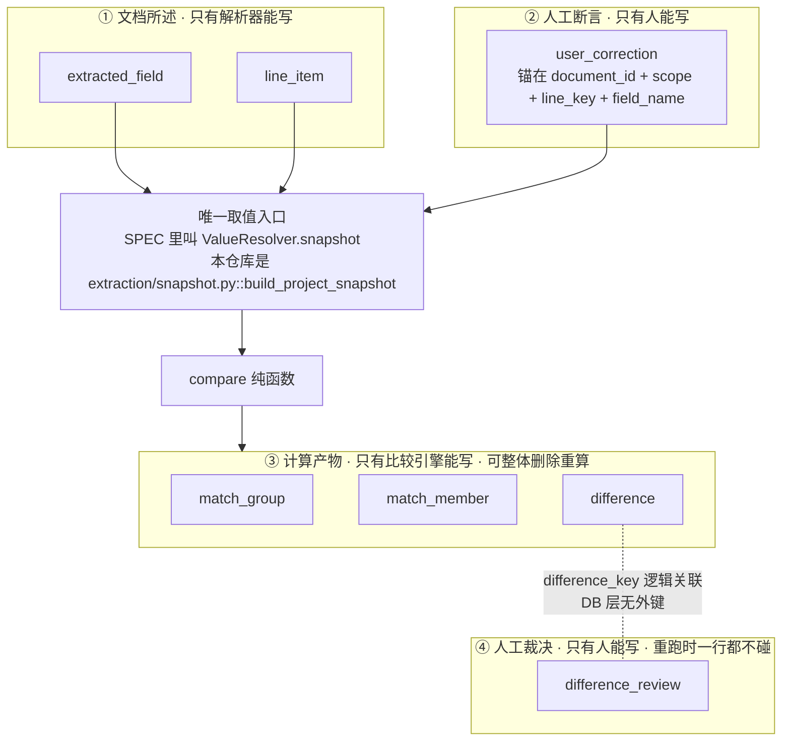

# 数据模型

> 对应 [`SPEC.md`](SPEC.md) §3。**表结构以 SPEC §3.2 为准**，本文补充每张表的用途、字段含义，
> 并把三条最重要的架构决策的**理由**讲清楚。
>
> 三条决策分别是：
> 1. [四类数据与写权限互斥](#1-四类数据与写权限互斥)
> 2. [为什么 `difference` 表不含 `review_status`](#5-为什么-difference-表不含-review_status)
> 3. [为什么 `difference_key` 不含具体数值](#6-为什么-difference_key-不含具体数值)
> 4. [为什么用 `match_group` + `match_member` 而不是三个外键](#7-为什么用-match_group--match_member-而不是三个外键)

---

## 0. 当前实现状态

模型分两套，**刻意如此**：

- **内存领域模型**（`backend/app/domain/models.py`）：一组 frozen dataclass，
  比较引擎的唯一输入输出，**不含任何 ORM 对象**。
- **持久化模型**（`backend/app/db/models.py`）：SQLAlchemy 声明式模型，
  由 `backend/app/services/projects.py` 独占写入。

比较引擎的输入是 `ProjectSnapshot`（纯数据），因此**比较、匹配、导出三层永远不知道
数据库存在**——这一点有 import 级守卫强制（`test_guards.py::TestImportBoundary`）。

| SPEC §3.2 的表 | 落库 | SQLAlchemy 模型 | 内存对偶 |
|---|---|---|---|
| `project` | ✅ | `Project` | — |
| `document` | ✅ | `Document` | `SnapshotDocument`（只承载比较所需部分） |
| `user_correction` | ✅ | `UserCorrection` | `CorrectionInput`（`extraction/snapshot.py`） |
| `match_group` | ✅ | `MatchGroup` | `MatchGroupDraft` |
| `match_member` | ✅ | `MatchMember` | `MatchMemberDraft` |
| `evidence` | ✅ | `Evidence` | `EvidenceDraft` |
| `difference` | ✅ | `Difference` | `DifferenceDraft` |
| `difference_review` | ✅ | `DifferenceReview` | —（裁决不进比较引擎） |
| `extracted_field` | ⬜ **未落库** | — | `SnapshotDocument.fields: Mapping[str, ValueCell]` |
| `line_item` | ⬜ **未落库** | — | `SnapshotLineItem` |
| `difference_evidence`（链接表） | ⚠️ **用 JSON 列替代** | `Difference.evidence_ids` | `DifferenceDraft.evidence_ids` |

### 0.1 两处与 SPEC §3.2 的实际偏差

**① `extracted_field` / `line_item` 未落库。** `services/projects.py::_process` 每次
从磁盘上的原始文件**重新解析**。解析是确定性的、原始文件始终在，所以结果正确。

代价：`line_item.raw_cells` 这条「可逆性保险」（SPEC §2.1）**当前不成立**——
它的价值在于「后续补任何字段都能从库内回填、不必重新解析原始文件」，
现在因为总是重新解析，效果上等价；但**一旦原始文件被删除，历史项目就无法回填**。

**② `difference_evidence` 链接表被 JSON 列替代。** `difference.evidence_ids` 是一个
JSON 数组。正向查询（差异 → 证据）功能等价，但**无法按证据反查差异**，也没有引用完整性。

两条都记在 [`limitations.md`](limitations.md) §6.1。

### 0.2 模型层与 SPEC §3.2 的逐列差异

以下全部以 `backend/app/db/models.py` 为准。**SPEC 是规格，本节是实测。**

| # | SPEC §3.2 | 实现 | 影响 |
|---|---|---|---|
| 1 | `match_member.line_item_id TEXT NOT NULL UNIQUE REFERENCES line_item(id)` | `match_member.line_item_ref TEXT UNIQUE`（存 `f"{document_id}:{line_key}"`），**无外键** | `line_item` 未落库，没有可引用的目标。`UNIQUE` 保留了——它才是「不强行匹配」的机器证明，这一点没有妥协 |
| 2 | `document` 无 `parse_detail` | 多一列 `parse_detail TEXT NULL` | 存**中文展示文案**（`ParseCapability.detail`）。`parse_reason_code` 仍是唯一的结构化判据，golden 与筛选都只看它 |
| 3 | `evidence` 有 `locator TEXT NULL`（PDF 定位判别联合 JSON） | ⬜ **该列不存在** | PDF 属 MVP-1，MVP-0 的证据全是 `XLSX_CELL` / `DERIVED`，定位已拍平成 `sheet_name` / `cell_reference` / `row_index` / `col_index`。落地 PDF 时需要加回来 |
| 4 | `evidence.document_id REFERENCES document(id) ON DELETE CASCADE` | `evidence.document_id` 是**普通字符串列**；级联挂在新增的 `evidence.project_id -> project.id ON DELETE CASCADE` 上；另有 `evidence.role` 列 | 删项目照常级联。**但删单份文档不会级联删它的证据**——证据是计算产物，由 `run_comparison()` 全删全插重建，这条路径靠重跑收敛而不是靠外键 |
| 5 | `difference_review` 无 `run_fingerprint` | 多一列 `run_fingerprint TEXT NOT NULL DEFAULT ''` | 记录做出判断时的项目输入指纹，用来区分「同一轮内的重复查询」与「改了输入之后的重跑」。**弱身份差异只在跨轮时才不继承**——没有它，同一轮内刷新页面都会把刚做的裁决丢掉 |
| 6 | `difference_evidence` 链接表 | ⚠️ 用 `difference.evidence_ids` JSON 列替代 | 见 §0.1 ② |
| 7 | `extracted_field` / `line_item` | ⬜ 未落库 | 见 §0.1 ① |

---

## 1. 四类数据与写权限互斥

**这是全项目最重要的一条建模决策。**

### 1.1 它防的是什么

原始设计允许「修正提取结果」和「替换文件」，但从未定义修正值写到哪一列、重跑时旧差异与审核状态怎么办。默认实现必然是：

```
覆写 extracted_field.normalized_value  +  difference 表 delete-all + insert
```

后果：**用户改一个单价 → 已经标注好的审核状态全部静默归零。**

而「人工审核后导出报告」正是本产品的核心价值。审核状态被静默清空，等于产品最贵的那部分工作被一次误操作抹掉，且用户不会收到任何提示。

### 1.2 四个类别

| 类别 | 实体 | **谁能写** | 生命周期 |
|---|---|---|---|
| ① 文档所述 | `extracted_field`、`line_item` | **只有解析器** | 随 `document` 级联 |
| ② 人工断言 | `user_correction` | **只有人** | 独立，锚在领域坐标 |
| ③ 计算产物 | `difference`、`match_group`、`match_member` | **只有比较引擎** | 任何时刻可整体删除重算 |
| ④ 人工裁决 | `difference_review` | **只有人** | 独立于 ③ |



### 1.3 三条不可违反的推论

```
1. extracted_field.normalized_value / line_item.* 永远不被用户写
2. difference 表不含 review_status / review_note
3. 重跑 = DELETE difference / difference_evidence / match_group / match_member
        + 全量 insert
        + 一行 difference_review 都不碰
```

本仓库 `services/projects.py::run_comparison()` 里的实际删除集合是
**`match_member` / `match_group` / `difference` / `evidence`** —— `difference_evidence`
链接表被 `difference.evidence_ids` JSON 列替代（§0.1 ②），而 `evidence` 同样是计算产物，
必须一起重建。`difference_review` **完全不出现在这个函数里**，这是可以被机械检查的。

第 1 条的具体兑现方式：人工修正**不覆写**解析结果，而是新增一条 `user_correction`，
在装配快照（SPEC 里的 `ValueResolver.snapshot()`）时合流。合流后的 `ValueCell`
同时携带两个值：

```python
ValueCell(
    value="4800",                    # 生效值（人填的）
    source=ValueSource.USER_CORRECTION,
    parser_value="480O",             # 机器原本读到的（保留）
    correction_reason="OCR 把 0 读成了 O",
)
```

这样报告里「这个数是机器读的还是人填的」**精确到字段**——报告要发给老板和客户，这个区分不能丢。

当前已实现的合流逻辑见 `backend/app/extraction/snapshot.py::_apply_correction`。

> **命名对照**：SPEC §11.2 把唯一取值入口写作 `ValueResolver.snapshot(project_id)`。
> 本仓库**没有名为 `ValueResolver` 的类**，同一职责由
> `extraction/snapshot.py::build_project_snapshot()` 这个纯函数承担
> （服务层入口是 `services/projects.py::build_result()`）。
> 约束没有变——它仍然是比较引擎拿到 `ProjectSnapshot` 的唯一路径，
> 由 `tests/test_guards.py::TestImportBoundary` 从 import 层强制。

---

## 2. 实体清单

以下为 SPEC §3.2 定义的表结构。**建表语句以 SPEC 为准**，此处只解释用途与关键字段。

### 2.1 `project` —— 项目

一次核对任务。

| 字段 | 说明 |
|---|---|
| `status` | `DRAFT` / `READY` / `COMPARED` |
| `compared_at` | 上次运行检查的时间 |
| `comparison_input_fingerprint` | 三段子哈希 `docs:...\|corrections:...\|rules:...` |

**刻意不设 `STALE` 状态。** 新鲜度与流程阶段是正交的两件事：靠指纹自证「结果是否还对应当前输入」，
不靠某条写路径记得把标志位置上。少一个必须被每条写路径记住的约定，就少一类静默失效。

### 2.2 `document` —— 文档

| 字段 | 说明 |
|---|---|
| `role` | `QUOTATION` / `PURCHASE_ORDER` / `PROFORMA_INVOICE` |
| `revision` / `superseded_at` | 同一角色被替换时的版本链 |
| `original_filename` | **仅作元数据**，不参与任何路径拼接 |
| `stored_filename` | **随机 UUID，不含任何用户可控成分** |
| `sha256` | 内容指纹，参与 `comparison_input_fingerprint` |
| `parse_status` | `PENDING` / `OK` / `NEEDS_REVIEW` / `REJECTED` / `FAILED` |
| `parse_reason_code` | **结构化字段**，不是拼在中文文案里的字符串 |
| `parse_detail` | 实现新增列（SPEC §3.2 没有）：给人看的中文文案。**任何判定都不许读它** |
| `parse_diagnostics` | JSON，解析统计与告警 |

```sql
CREATE UNIQUE INDEX ux_document_active_role
  ON document(project_id, role) WHERE superseded_at IS NULL;
```

部分唯一索引保证「一个项目里每个角色最多一份**生效**文档」，同时允许保留历史版本。

`parse_reason_code` 必须结构化的理由很硬：**否则 golden test 只能靠字符串匹配**，中文文案微调就会红一片。

### 2.3 `extracted_field` —— 文档级提取字段

EAV 结构（`field_name` 是字符串列）。**四元组必须齐全**：

| 字段 | 含义 |
|---|---|
| `raw_value` | 单元格原文 |
| `parsed_value` | 解析后的中间值 |
| `normalized_value` | 归一化值（比较用） |
| `parse_warning` | 「读到了但不确定」的说明 |
| `value_type` | 对应 `FieldSpec.value_kind` |
| `confidence` | **Decimal as TEXT** |
| `extraction_method` | `alias` / `layout` / `user_confirmed` —— **白名单同时是「LLM 没有偷偷变成必需依赖」的机器证明** |
| `evidence_id` | 指向证据 |

`is_user_confirmed` **刻意不在表里**，改为 DTO 计算字段（= 是否存在对应的 `user_correction`）。
理由同 §1：一个可以被推导出来的状态位，一旦落库就多了一条必须被每次写入记得维护的路径。

EAV 结构还有一个直接收益：**v2 加任意文档级字段 = 一条别名 + 一条严重度配置，零数据库迁移、零接口变更。**
这就是 SPEC §4.1 敢把 15 个字段推给 future-scope 的硬理由。

### 2.4 `line_item` —— 行项目

| 字段 | 说明 |
|---|---|
| `line_key` | **冻结身份**，见 §4 |
| `row_index` | 原表行号 |
| `sku_norm` | 归一化型号，建索引 |
| `quantity` / `unit_price` / `line_total` / … | **一律 Decimal as TEXT，全程禁止 float** |
| `raw_cells` | **JSON NOT NULL**，见下 |

**`raw_cells JSON NOT NULL` 是一条几乎免费的保险。** 它存本行每个单元格的
`{addr, value, data_type, formula, cached_value, merged_range}`。

有了它，后续补任何字段都能**从库内回填、不必重新解析原始文件**——它把「漏列」这个问题
从**不可逆**降级为**可逆**。这是「砍实现、保形状」策略里性价比最高的一条。

### 2.5 `match_group` / `match_member` —— 匹配组

见 §7 的完整论证。

| `match_group` 字段 | 说明 |
|---|---|
| `group_key` | **纯自然键，禁止含任何 DB 主键** |
| `match_method` | `SKU_EXACT` / `CUSTOMER_PART_MAP` / `FUZZY_CANDIDATE` / `UNMATCHED` / `USER_MANUAL` |
| `match_reason` | **人可读的匹配理由**，强制要求 |
| `role_signature` | 如 `Q1:P2:I0`，每个角色的成员数 |
| `multiplicity_state` | `UNIQUE_PER_ROLE` / `MULTI_PER_ROLE` |
| `coverage_state` | `FULL` / `PARTIAL` / `ISOLATED` |

```sql
CREATE TABLE match_member (
  ...
  line_item_id TEXT NOT NULL UNIQUE REFERENCES line_item(id) ON DELETE CASCADE,
  ...
);
```

`line_item_id` 上的 `UNIQUE` 是完成标准「未对齐项目不会被强行匹配」的**机器证明**。
配一条全量断言同时守住它的对偶——「没有行被静默丢弃」：

```
COUNT(line_item WHERE project = P) == COUNT(match_member JOIN match_group WHERE project = P)
```

这条断言当前已在内存版实现：`backend/app/matching/engine.py::assert_partition`，在 `compare()` 开头实际调用。

### 2.6 `difference` —— 差异（计算产物）

| 字段 | 说明 |
|---|---|
| `difference_key` | 稳定身份，见 §6 |
| `identity_strength` | `STRONG` / `WEAK`，决定重跑时是否继承审核状态 |
| `scope` | `DOCUMENT` / `LINE_ITEM` / `CALCULATION` |
| `subject_kind` + `subject_key` | 差异挂在谁身上（`DOCUMENT_ROLE:PROJECT` 或 `MATCH_GROUP:SKU:AB-100`） |
| `difference_type` | 8 个值的冻结全集 |
| `severity` | `CRITICAL` / `WARNING` / `REVIEW` / `INFO` |
| `severity_rule_id` | **可追溯到 FieldSpec 的哪一条**，如 `unit_price@ORDER_TO_CONFIRMATION` |
| `chain_stage` | 严重度的查表依据 |
| `values_by_document` | JSON，见下 |
| `values_digest` | **前提摘要**，用于失效判定 |
| `explanation_key` + `explanation_params` | **不存拼好的句子** |
| `has_user_input` | 本条差异是否涉及人工修正过的值 |

**注意这张表没有 `review_status` 和 `review_note`。** 见 §5。

`values_by_document` 的结构：

```json
{
  "PURCHASE_ORDER":   { "value": "5000", "source": "PARSER",
                        "parser_value": "5000", "correction_reason": null,
                        "confidence": "0.95" },
  "PROFORMA_INVOICE": { "value": "4800", "source": "USER_CORRECTION",
                        "parser_value": "480O", "correction_reason": "..." }
}
```

**`explanation_key` + `explanation_params` 不存拼好的句子**，有两个理由：

1. 界面与报告是中文单语，句子在展示层渲染；**golden tests 不得对 explanation 文本做字符串比对**，否则措辞微调红一片。
2. 参数是结构化的，可以直接用于筛选、统计、导出。

### 2.7 `difference_evidence` —— 差异 ↔ 证据链接表

**一条差异对多份文件的证据，单个 `evidence_id` 基数就是错的。** 一条「PO 5000 / PI 4800」的
差异至少要指向两个单元格；一条计算错误要指向三个格子加一条算式。

### 2.8 `difference_review` —— 人工裁决

```sql
CREATE TABLE difference_review (
  id TEXT PRIMARY KEY,
  project_id TEXT NOT NULL,
  difference_key TEXT NOT NULL,      -- 逻辑外键，DB 层无引用完整性（刻意）
  identity_strength TEXT NOT NULL,
  review_status TEXT NOT NULL,       -- OPEN | CONFIRMED_DIFFERENCE | ACCEPTED_DIFFERENCE
                                     -- | NEEDS_CONFIRMATION | IGNORED | RESOLVED
  review_note TEXT NULL,
  premise_digest TEXT NOT NULL,      -- 做出判断时的 values_digest
  run_fingerprint TEXT NOT NULL DEFAULT '',  -- 实现新增：做出判断时的项目输入指纹
  premise_snapshot TEXT NOT NULL,    -- JSON，用于「你上次是基于 X 判断的」
  created_at TEXT NOT NULL,
  updated_at TEXT NOT NULL,
  UNIQUE(project_id, difference_key)
);
```

`run_fingerprint` 是 SPEC §3.2 之外的一列（见 §0.2 第 5 条），用来把
「弱身份不继承」这条规则限定在**跨轮**：`identity_strength = WEAK` 的裁决
在同一轮内照常显示，输入指纹一变才不再继承。没有它，用户刚点完「已确认」、
刷新一下页面就会看到它变回「待处理」——那是比丢失更让人不信任的表现。

**刻意不设外键。** `difference_review.difference_key` 是逻辑外键，DB 层没有引用完整性。
这是有意的解耦代价：**加 FK 就等于把裁决绑回产物的生命周期**，而产物每次重跑都被全删全插。

`premise_digest` + `premise_snapshot` 这一对是「前提失效」机制的全部实现：前者用于判定，后者用于展示。

### 2.9 `user_correction` —— 人工修正

```sql
UNIQUE(document_id, scope, line_key, field_name)
```

**锚在领域坐标上，不锚 `extracted_field.id`。**

理由：重解析同一文件时主键全换新，锚主键 = **所有修正静默变孤儿**。锚领域坐标免费得到正确行为：

| 操作 | 结果 |
|---|---|
| 重新解析同一文件 | 修正**存活**（`line_key` 由解析器读数冻结，不变） |
| 替换文件（新 `document`） | 修正随 `document` 级联消失（正确——那是另一份文件了） |

`superseded_value` 保存被覆盖的机器值，**报告要能显示它**。

### 2.10 `evidence` —— 证据

| 字段 | 说明 |
|---|---|
| `source_type` | `XLSX_CELL` / `XLSX_RANGE` / `PDF_TEXT` / `DERIVED` |
| `sheet_name` / `cell_reference` / `row_index` / `col_index` | **XLSX 定位拍平成列**——要按它查询 |
| `locator` | PDF 定位的判别联合 JSON——**只按 id 取，不查询**。⬜ **MVP-0 未落库**（见 §0.2 第 3 条） |
| `raw_text` | 原文 |
| `derived_from` | JSON：计算类差异的证据。`quantity × unit_price ≠ line_total` 是两个格 + 一个算式；`Σ行金额 ≠ 总金额` 是**参与求和的每一行金额格 + 总金额格** |
| `parser_metadata` | JSON |
| `project_id` / `role` | 实现新增两列（SPEC §3.2 没有）：级联删除挂在 `project_id` 上，`role` 免掉一次 `document` 联表 |

XLSX 定位拍平成独立列、PDF 定位塞进 JSON，区别只有一个：**是否需要按它做查询**。

---

## 3. 枚举全集（冻结）

全部枚举在 `backend/app/domain/enums.py`，**是唯一来源**，任何地方不得使用裸字符串字面量代替。

| 枚举 | 值 |
|---|---|
| `DocumentRole` | `QUOTATION` `PURCHASE_ORDER` `PROFORMA_INVOICE` |
| `ParseStatus` | `PENDING` `OK` `NEEDS_REVIEW` `REJECTED` `FAILED` |
| `ParseReasonCode` | `UNSUPPORTED_EXT` `ENCRYPTED` `CORRUPT` `INSUFFICIENT_TEXT` `UNSUPPORTED_TEXT_LAYER` `ROW_LIMIT` `SHEET_LIMIT` `NO_TABLE_FOUND` `FORMULA_WITHOUT_CACHE` `FILE_TOO_LARGE` |
| `Scope` | `DOCUMENT` `LINE_ITEM` `CALCULATION` |
| `SubjectKind` | `DOCUMENT_ROLE` `MATCH_GROUP` |
| `DifferenceType` | `VALUE_CONFLICT` `MISSING_VALUE` `CALCULATION_ERROR` `UNMATCHED_LINE_ITEM` `AMBIGUOUS_MATCH` `SEMANTIC_DIFFERENCE` `EXTRACTION_UNCERTAIN` `INCOMPARABLE` |
| `Severity` | `CRITICAL` `WARNING` `REVIEW` `INFO` |
| `ChainStage` | `OFFER_TO_ORDER` `ORDER_TO_CONFIRMATION` `OFFER_TO_CONFIRMATION` `WITHIN_DOCUMENT` |
| `Verdict` | `EQUAL` `DIFFERENT` `INCOMPARABLE` `UNCERTAIN` `MISSING` |
| `MatchMethod` | `SKU_EXACT` `CUSTOMER_PART_MAP` `FUZZY_CANDIDATE` `UNMATCHED` `USER_MANUAL` |
| `MultiplicityState` | `UNIQUE_PER_ROLE` `MULTI_PER_ROLE` |
| `CoverageState` | `FULL` `PARTIAL` `ISOLATED` |
| `SelectionState` | `AUTO_SELECTED` `CANDIDATE` `USER_SELECTED` `USER_REJECTED` |
| `MatchGroupStatus` | `RESOLVED` `NEEDS_USER_DECISION` |
| `ReviewStatus` | `OPEN` `CONFIRMED_DIFFERENCE` `ACCEPTED_DIFFERENCE` `NEEDS_CONFIRMATION` `IGNORED` `RESOLVED` |
| `IdentityStrength` | `STRONG` `WEAK` |
| `ExtractionMethod` | `alias` `layout` `user_confirmed` |
| `ValueKind` | `TEXT` `DECIMAL` `MONEY` `CURRENCY` `DATE` `ENUM` `STRUCTURED` |
| `ValueSource` | `PARSER` `USER_CORRECTION` |
| `CorrectionKind` | `OVERRIDE` `CONFIRM` |
| `EvidenceSourceType` | `XLSX_CELL` `XLSX_RANGE` `PDF_TEXT` `DERIVED` |
| `ProjectStatus` | `DRAFT` `READY` `COMPARED` |

共 22 个 `StrEnum`。同一模块还有三张**不是枚举、但同样是单一真源**的常量表：
`ROLE_ORDER`（贸易链条顺序，`chain_stage` 的方向由它决定）、
`SEVERITY_ORDER`（排序用）、
`SIGNATURE_TAGS`（`role_signature` 的角色缩写与固定顺序，`Q1:P2:I0`）。
`SIGNATURE_TAGS` 的生产方与消费方必须读同一份——见
[`architecture.md`](architecture.md) §11.2。

**API / DB / golden 只用这些英文标识符；界面与报告是中文单语。** 前后端各一份「枚举 → 中文」映射表，
**不引入任何 i18n 框架**。

Gate-0 第 16 条「只产已声明枚举」由 `-m enum_subset` 标记的测试机械检查：运行时产出的所有枚举值必须是声明全集的子集。

---

## 4. 三个身份函数

三个纯函数是整个系统最贵的契约（`backend/app/domain/identity.py`，已实现且有单测）。
选错会导致人工修正解锚、审核状态静默丢失、golden test 不稳定。

### 4.1 `line_key` —— 锚定人工修正

```python
if sku_norm:            return f"sku:{sku_norm}#{sku_ordinal}"
if customer_part_norm:  return f"cpn:{customer_part_norm}#{cpn_ordinal}"
return f"pos:{sheet_name}!{row_index}"
```

**由解析器确定性生成，基于解析器读数冻结，永不因人工修正改变。**

否则会发生这件事：用户修正了 SKU → `line_key` 跟着变 → 挂在旧 `line_key` 上的
`user_correction` **自己把自己解锚了**。

`ordinal` 从 1 开始，用于区分同一文档内重复的型号 / 客户料号。

### 4.2 `group_key` —— 锚定匹配组

**全自然键，保证重复执行稳定，禁止出现任何 DB 主键。**

```
SKU:{归一SKU}                    一级精确匹配
SKU:{归一SKU}#{attr}={值}        消歧后（MVP-1）
FUZZY:{排序拼接的 ROLE:row_index} 模糊候选（MVP-1，必须排序）
NOSKU:{ROLE}:{row_index}         无 SKU 的孤立行
```

含 DB 主键就完了：重跑时 `match_group` 全删全插，主键全换新，`group_key` 跟着变，
所有挂在它上面的差异身份全部失效。

`FUZZY` 必须排序拼接：不排序则同一组在不同迭代顺序下产生不同 key，直接违反「重复执行结果稳定」。

### 4.3 `difference_key` —— 锚定人工裁决

```python
sha256(f"{scope}|{difference_type}|{field_name or ''}|{subject_kind}:{subject_key}")[:32]
```

见 §6 的完整论证。

### 4.4 `identity_strength`

| 强度 | 判定 | 重跑行为 |
|---|---|---|
| `STRONG` | subject 能由稳定自然键唯一确定 | 继承审核状态 |
| `WEAK` | 重复 SKU 的第 2 行及以后、无 SKU 也无客户料号的行、`AMBIGUOUS_MATCH` | **不继承** |

**`WEAK` 不继承审核状态——宁可可见地丢，不可错挂。** 前端报 `weak_identity_count`，
让用户知道有多少条需要重新看。

**禁止**使用 `unstable:<uuid4>` 之类的占位——那会让 `difference` 表每跑一次内容不同，
直接违反「重复执行结果稳定」。

---

## 5. 为什么 `difference` 表不含 `review_status`

### 5.1 结论

`difference` 表**不含** `review_status` 与 `review_note`。人工裁决独立存放在 `difference_review`，
**DB 层刻意不设外键**。

### 5.2 理由：两者的生命周期根本不同

| | `difference` | `difference_review` |
|---|---|---|
| 谁写 | 比较引擎 | 人 |
| 何时变 | 每次重跑全删全插 | 只在用户点击时 |
| 能否重算 | **可以，任何时刻整体删除重算** | **不能，重算一次就是数据丢失** |

一张表只能有一种生命周期。把两者放在一张表里，就必须在「重跑」这个动作上做二选一：

| 方案 | 后果 |
|---|---|
| A：重跑时 `DELETE` 整表再插 | **审核状态全部静默归零**——用户改一个单价，昨天标注的 20 条全没了 |
| B：重跑时逐条 `UPDATE`，保留审核列 | 需要「这次算出来的差异 ↔ 上次那条」的稳定对应关系，**而这正是 `difference_key` 要解决的问题**；同时 UPDATE 路径必须精确地知道哪些列是产物、哪些列是裁决，**每加一个字段就多一次犯错机会** |

方案 B 看起来更省事，实际上是把「两种生命周期」的矛盾从表结构挪到了写路径上——
挪到一个**没有任何机制强制、只能靠人记得**的地方。

拆表之后，重跑的语义变得可以一句话说清、也可以被机械检查：

```
重跑 = DELETE difference / difference_evidence / match_group / match_member
     + 全量 insert
     + 一行 difference_review 都不碰
```

「一行都不碰」是可以被测试断言的；「记得保留这几列」不是。

### 5.3 代价与它的偿付

代价是失去了 DB 层的引用完整性，需要在读取时按 `difference_key` 合成：

| 情况 | 行为 |
|---|---|
| 前提未变（`values_digest == premise_digest`） | 沿用原 `review_status` + `review_note` |
| 前提已变 | 置 `NEEDS_CONFIRMATION`，**保留备注**，展示「你上次是基于 PO 5000 / PI 4800 判断的」 |
| `identity_strength = WEAK` | **不继承**，前端报 `weak_identity_count` |
| 本次未产生该 key | `difference_review` 行保留为孤儿，提供「清理」按钮 |

这四行不是补丁，是四种**必须让用户看见**的状态。如果放在同一张表里靠 UPDATE 维护，
第二行「前提已变」会退化成「值悄悄变了但状态还是已确认」——**这是比数据丢失更危险的失效**，
因为它看起来一切正常。

对应的集成测试（Gate-0 第 11 条）：**审核 20 条 → 修正 1 个单价 → 重跑 → 19 条状态原样保留，
1 条置 `NEEDS_CONFIRMATION` 且备注保留。**

---

## 6. 为什么 `difference_key` 不含具体数值

### 6.1 结论

```python
def difference_key(*, scope, difference_type, field_name, subject_kind, subject_key) -> str:
    payload = f"{scope}|{difference_type}|{field_name or ''}|{subject_kind}:{subject_key}"
    return sha256(payload).hexdigest()[:32]
```

**参数里没有任何具体数值。** 也没有任何 DB 主键。

### 6.2 理由：含了值就恰好在最需要它的时候失效

假设把值放进 key：`key = hash(..., "PO=5000|PI=4800")`。

```
第 1 次运行  →  差异「PO 5000 / PI 4800」，key = A
用户审核     →  标记为「已确认差异」，备注「客户口头同意改 4800」
用户修正 PI 的一个错读值  →  重跑
第 2 次运行  →  差异「PO 5000 / PI 4900」，key = B ≠ A
```

结果：`key = A` 的审核记录变成孤儿，`key = B` 是一条崭新的「未审核」差异。
**用户写的那句备注和当时的判断，在最需要它的那一刻消失了。**

而「用户改了值之后重跑」正是**审核状态继承唯一真正重要的场景**。平时不改值的重跑，
key 含不含值都一样；一旦改了值，含值的 key 必然全部失配。

换句话说：**把值放进 key，等于让继承机制在它唯一有用的场景下 100% 失效。**

### 6.3 那「前提变了」怎么办

不是不管，是**分开管**：

| 关心的问题 | 由谁回答 |
|---|---|
| 这是不是**同一条**差异？ | `difference_key`（身份，不含值） |
| 我上次的判断**依据**还成立吗？ | `values_digest` vs `premise_digest`（前提，含值） |

`values_digest(values_by_role)` 对全部角色的值排序后取摘要（**必须按角色名排序**，否则
dict 顺序会污染摘要）。读取时两者一比，就能精确地把差异分成三档：

```
同一条 + 前提未变  →  沿用原判断
同一条 + 前提已变  →  NEEDS_CONFIRMATION，保留备注，展示旧前提
不是同一条         →  新差异 / 孤儿裁决
```

把「身份」和「前提」拆成两个字段，两个问题都能被精确回答。合并成一个 key，两个问题都答不好。

### 6.4 为什么也不能含 DB 主键

重跑时 `difference` / `match_group` / `match_member` 全删全插，**主键全换新**。
key 含主键 = key 每次都变 = 和 §6.2 是同一个错误。

同理**禁止** `unstable:<uuid4>` 之类的占位：那会让 `difference` 表每跑一次内容都不同，
直接违反 Gate-0 第 15 条「连跑 3 次，差异集合与全部 fingerprint 逐字节一致」。

---

## 7. 为什么用 `match_group` + `match_member` 而不是三个外键

### 7.1 被否掉的方案

原始设计是一张 `LineItemMatch` 表，三个固定外键：

```sql
CREATE TABLE line_item_match (
  quotation_line_item_id       TEXT NULL,
  purchase_order_line_item_id  TEXT NULL,
  proforma_invoice_line_item_id TEXT NULL,
  ...
);
```

### 7.2 理由一：三外键在结构上只能表达 1:1:1

而原始需求自己把「同一 SKU 重复多行」「套装与单件」列为**必须处理**，
fixture 清单里也有对应场景——**计划自己和自己矛盾**。

真实场景，天天发生：

> 报价单 1 行：`SKU-A`，共 150 pcs
> 客户 PO 按颜色拆成 2 行：`SKU-A` 红 100 pcs、`SKU-A` 蓝 50 pcs

三外键模型下，实现者只有一个出路：写两条记录，共用同一个 `quotation_line_item_id`。

于是差异引擎拿 150 分别去比 100 和 50：

```
❌ 假 VALUE_CONFLICT：数量 150 vs 100
❌ 假 VALUE_CONFLICT：数量 150 vs 50
❌ 假 CALCULATION_ERROR：金额对不上
```

**三条全是误报，且每一单拆行订单都会出现。** 这不是边缘情况，是外贸日常。

### 7.3 理由二：外键个数被角色个数写死

三个外键 = 永远只能是三种角色。加一个角色（比如「销售合同」「装箱单」）就要改表结构、
改索引、改所有查询、改所有导出。

而 SPEC §1.3 已经明确「不再强制三份齐全」，**比较引擎签名中不得出现数字 3**：

```python
compare(doc_set: Mapping[DocumentRole, ProjectSnapshotDocument], rules) -> list[Difference]
```

数据模型里写死 3 个外键，等于在存储层把这条规格作废掉。

### 7.4 采用的方案

```sql
match_group  (group_key, match_method, match_reason, role_signature,
              multiplicity_state, coverage_state, status, user_decision)
match_member (match_group_id, line_item_id UNIQUE, document_role,
              role_ordinal, selection_state)
```

一组多成员，成员数不受角色数限制。三个直接收益：

| 收益 | 说明 |
|---|---|
| **可以表达「多」** | 上面的拆行场景是一个组、三个成员（Q×1 + PO×2），`role_signature = Q1:P2:I0` |
| **可以表达「歧义」** | `multiplicity_state = MULTI_PER_ROLE` → 比较层**不做字段比较**，产出一条 `AMBIGUOUS_MATCH` 交人工 |
| **可以被机械验证** | `line_item_id` 上的 `UNIQUE` + 全量计数断言 |

### 7.5 配套红线：matching 层不做求和

有了多成员组之后，一个「聪明」的念头会立刻出现：把 PO 的 100 + 50 加起来变成 150，
和报价单的 150 一比——正好相等，报告干干净净。

**禁止这样做。**

多行求和后比较，等于替企业裁定「**分批交货 = 整批交货**」。这是一个商务判断，
直接违反本产品最根本的一条边界：**不得自动判断哪份文件正确。**

真实后果也很具体：如果客户 PO 拆成两行是因为**要分两批发货、分两次付款**，
求和后「一致」的报告会让业务员错过整个交付节奏的差异。

所以红线是：**matching 层不做求和、不做拆合推断、不做套装展开。**
多成员组一律产出 `AMBIGUOUS_MATCH`（`REVIEW`），列出全部候选行摘要，交人工。

配套回归断言：**2 成员单角色组产出 1 条 `AMBIGUOUS_MATCH` 且 0 条 `VALUE_CONFLICT`。**

> 这会让 `AMBIGUOUS_MATCH` 变多，演示观感变差。这是自觉选择，
> **不要为了「看起来更聪明」回调。**

### 7.6 `group_key` 与 `line_item_id UNIQUE` 的分工

| 约束 | 保证的事 |
|---|---|
| `UNIQUE(project_id, group_key)` | 组本身可重复执行地被识别 |
| `UNIQUE(match_member.line_item_id)` | **一行最多属于一个组**——「不强行匹配」 |
| 全量计数断言 | **一行至少属于一个组**——「不静默丢弃」 |

两条断言必须成对存在。只有前者，行会被悄悄丢掉；只有后者，行会被塞进多个组。

---

## 8. SQLite 陷阱（落地时必须处理）

```python
@event.listens_for(Engine, "connect")
def _fk_on(dbapi_conn, _):
    dbapi_conn.execute("PRAGMA foreign_keys=ON")
```

**`PRAGMA foreign_keys` 默认是 OFF，SQLAlchemy 不会替你打开。**

不挂这个事件，上面全部的 `ON DELETE CASCADE` 都是装饰品：删除项目会留下孤儿行 + 孤儿文件，
而「删除项目会删除对应数据和文件」这条承诺**静默失效**——用户以为删掉了，实际没有。

Gate-0 第 13 条对此有断言：**删除项目 → 库内 orphan 计数 = 0 且磁盘文件已删。**

---

## 9. 相关文档

- [`SPEC.md`](SPEC.md) §3 —— 权威表结构定义
- [`architecture.md`](architecture.md) —— 各层如何使用这些数据
- [`comparison-rules.md`](comparison-rules.md) —— 每个字段的比较规则（**由代码生成**）
- [`limitations.md`](limitations.md) —— 哪些表还没落地
